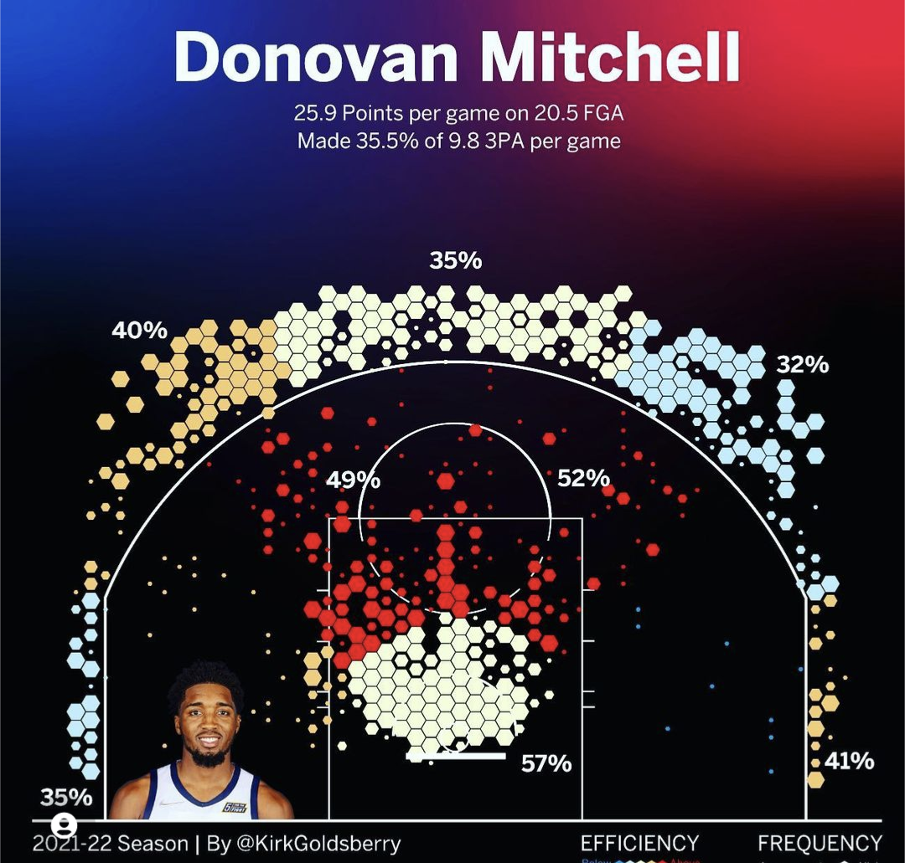
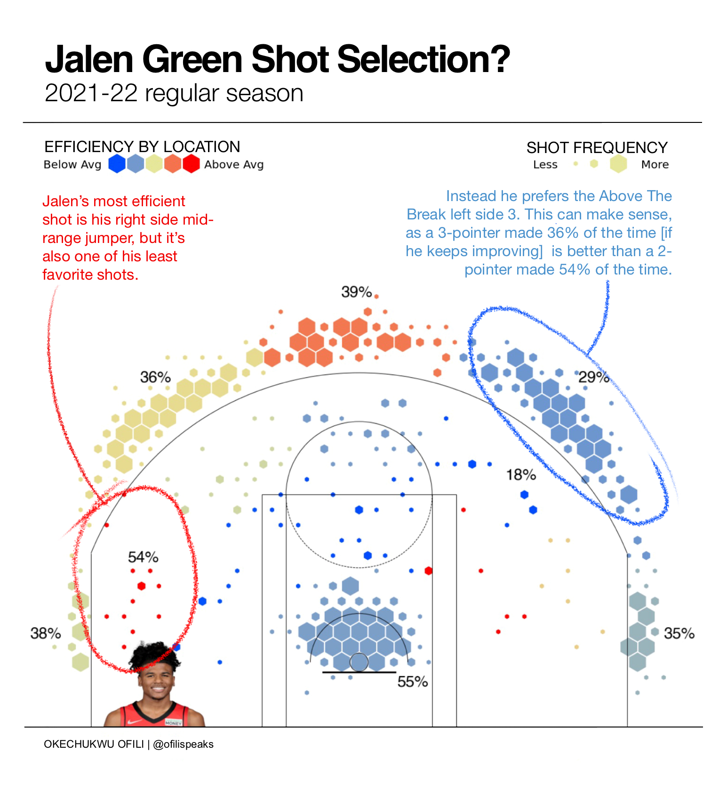

### Background

I have been blown away by Kirk Goldberry’s NBA shot chart visualizations ever since I stumbled upon his Instagram page (https://www.instagram.com/kirkgoldsberry) last year. He essentially revolutionized the way NBA data was used by applying it on the court using hexbins color and size to drive insights that were previously unseen in the NBA.

I was so enthralled by his visualization, that I wanted to learn how to create his charts just like this https://www.instagram.com/p/Ch_etB4vCXU/?hl=en and that is what this project is about.

### Problem Statement

This project aims to recreate Kirk Goldberry’s shot chart using a Jupyter NoteBook powered by Swar Patel’s excellent NBA API https://github.com/swar/nba_api to populate the shot chart, and a light weight graphics program liek ProCreate to add the text.

### Methodology

> "The reason technology seems hard is because it is hardly explained." - Okechukwu Ofili

I use python casually and due to time I knew I had to leverage and build on existing work on this topic. So I reviewed several examples that showed how a Jupyter notebook could be used to create an NBA shot chart. The code was great for most of them, but the visual end product did not reach the Kirk Goldberry shot charts I was looking to replicate (reference figure below):

But luckily I stumbled upon the work done by Daniel Welch https://danielwelch.github.io/nba-team-shot-charts.html [which built on the Grantland’s work]. For the first time, I saw a visual that was close to what I was looking for.

So using Kirk Goldberry as a reference, working with Swar Patel’s NBA API and Daniel Welch’s Jupyter Notebook and getting distracted inspired halfway by reddit user [redditcoadmin] Jalen Green’s sanskey chart (https://www.reddit.com/r/dataisbeautiful/comments/x2jmn2/comment/imkf565/) I was able to create a clone Goldberry NBA shotchart and a Sanskey chart using Flourish. 

The most challenging part of the project was breaking down the coding that created the Hex Bins plots on an NBA court, which took me about 5 hours cummulatively to complete. But once I was able to understand it, I was able to create visually what I was looking for. The best part of this, is that I was able to document more the code used by Grantland and Daniel Welch (which is included in this project), so that others working on this in the future don't have to spend 5 hours to understand the code. 

### The Result

Below is what I was eventually able to come up with. For my first attempt, I am proud of myself.

### Learnings

- You can actually create the exact Goldberry Shotchart within Jupyter Notebook.
- The NBA API is a great tool, but it needs more/better documentation so that it could be used by even more people.

### Conclusion

Jupyter Notebook with Python is such a powerful combination and I hope to keep updating this repository with more code explanations to enable others create even more of these NBA shot chart visuals in the future.

> "Anything is possible"  - Kevin Garnett
